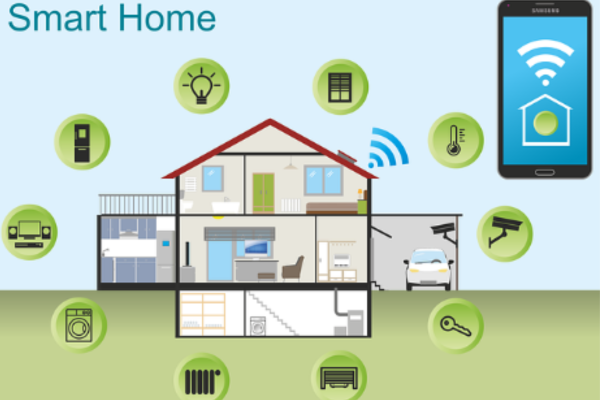

# e_home Smart Home Application



Welcome to the `e_home` smart home application repository! This application allows users to manage and control various smart home devices such as lights, cameras, thermostats, and more.

## Getting Started

### Prerequisites

Before getting started, ensure you have the following installed on your local machine:

- Node.js
- npm (Node Package Manager)
- PostgreSQL (for the backend)

### Clone the Repository

To clone the `e_home` repository, use the following command:

```bash
git clone <repository-url>
```

### Setting Up the Backend

1. Navigate to the `backend` directory:

```bash
cd backend
```

2. Install dependencies:

```bash
npm install
```

3. Create a PostgreSQL database for the application.

4. Set up the database connection in the `.env` file:

```
DB_USERNAME=<your-database-username>
DB_PASSWORD=<your-database-password>
DB_DATABASE=<your-database-name>
DB_HOST=<your-database-host>
DB_PORT=<your-database-port>
```

5. Run database migrations:

```bash
npm run migrate
```

6. Start the backend server:

```bash
npm start
```

### Setting Up the Frontend

1. Navigate to the `frontend` directory:

```bash
cd frontend
```

2. Install dependencies:

```bash
npm install
```

3. Set the backend API URL in the `.env` file:

```
REACT_APP_API_URL=http://localhost:8000/api
```

Replace `http://localhost:8000/api` with the URL of your backend API.

4. Start the frontend development server:

```bash
npm start
```

## Contributing

Contributions are welcome! If you'd like to contribute to the `e_home` project, please follow these steps:

1. Fork the repository.
2. Create a new branch (`git checkout -b feature/my-feature`).
3. Make your changes.
4. Commit your changes (`git commit -am 'Add new feature'`).
5. Push to the branch (`git push origin feature/my-feature`).
6. Create a new Pull Request.

## License

This project is licensed under the [MIT License](LICENSE).

